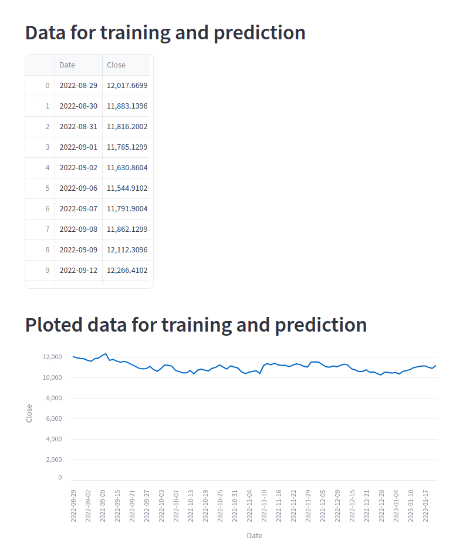

## The index funds ML price prediction app is not intended for real world application. The Index funds ML price prediction app is strictly for educational purposes!

### To run application

1. Install python3.9 and if necessary python3.9-venv

2. Create python enviroment in Documents folder and activate it
- `python3.9 -m venv "my_env_name"` 

- `source ~/Documents/venv_name/bin/activate`

3. Install packages
- `pip install -r requirements.txt`

4. To run app with streamlit run this command in terminal
- `streamlit run index_fund_streamlit.py`

5. To run app in jupyter notebook run this command in terminal
- `jupyter notebook`

6. To add python venv to jupyter notebook install
- `pip install ipykernel`
- `python -m ipykernel install --user --name=my-python3-kernel`

## Streamlit frontend

